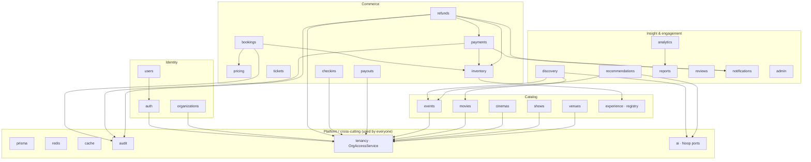

# ETicketsGo — Context Map

> The bounded contexts of the modular monolith, their allowed dependencies, and
> the rules that keep the import graph acyclic. Enforced in CI by
> `npm run deps:check` (`madge --circular`). See the
> [Architecture Handbook](../handbooks/ARCHITECTURE-HANDBOOK.md) for context
> responsibilities.

---

## Context map



Arrows show the **allowed** direction of dependency (caller → callee). Every
context may depend on the Platform layer (Prisma, Redis, Cache, Audit, Tenancy, AI
ports); those platform edges are omitted above for readability except where they
carry meaning.

---

## Inter-context communication rules

1. **Talk through application services, published interfaces, or registries — never
   another domain's repository.** A domain never reaches into another domain's
   Prisma models directly. Examples in the code:
   - `BookingsService` / `PaymentsService` reserve stock via the
     `InventoryStrategy` **interface** (resolved by `InventoryService`), not by
     writing `TicketInventory`/`ShowSeat` from inside bookings.
   - `DiscoveryService` composes `PublicEventsService.list` /
     `PublicMoviesService.list` rather than re-querying events/movies.
   - Booking price comes from `PricingStrategiesService.quote`; fees from
     `PricingService.quote`.
   - AI features are consumed through DI-token **ports** (`RECOMMENDATION_ENGINE`,
     …) bound to Noops in `AiModule`.

2. **Extension happens at the seam, not in the caller.** New inventory models,
   pricing rules, notification channels, discovery/recommendation lenses register
   an implementation of the seam interface and add one line to a registry/module.
   The engine that consumes the seam does not change (open/closed).

3. **The Platform layer is a leaf, not a hub of domain logic.** `prisma`, `redis`,
   `cache`, `audit`, and `tenancy` are depended upon by domains but do not depend
   back on them. `OrgAccessService` (tenancy) is the single place tenant-scoped
   authorization is decided; controllers/services call it rather than re-deriving
   membership.

4. **Cross-cutting concerns are global, not point-to-point.** Auth guards
   (`JwtAuthGuard`, `RolesGuard`), throttling, the error-envelope filter, and the
   correlation-id middleware are registered once in `app.module.ts` and apply to
   every route.

---

## Dependency-direction rule (the `deps:check` CI gate)

`npm run deps:check` runs:

```
madge --circular --extensions ts apps/api/src apps/worker/src
```

- It fails the build if **any import cycle** exists in the API or worker source.
- The practical rule this enforces: dependencies flow **one way** —
  `controller → service → seam interface / PrismaService`, and
  `concrete strategy / Noop → seam interface`. No arrow runs from a caller back to
  a concrete strategy, and no two domains import each other's modules in a loop.
- Because callers depend on **interfaces** (and DI tokens) rather than concrete
  implementations, adding a strategy or a channel introduces a new leaf node, never
  a cycle — so the graph stays acyclic as the platform grows.

If `deps:check` fails, `madge` prints the offending cycle; break it by moving the
shared type/interface to the seam file (or a platform module) that both sides can
depend on, rather than importing one domain's service from another domain to
satisfy a back-reference.
