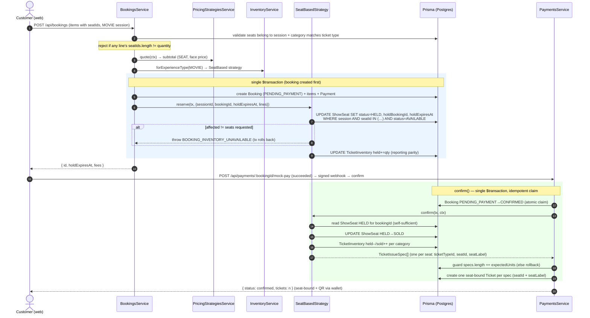
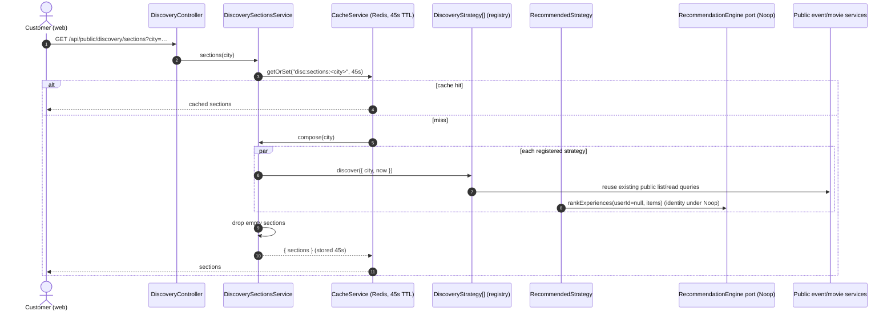

# ETicketsGo — Sequence Diagrams

> Mermaid `sequenceDiagram`s for the core flows, accurate to the code
> (`apps/api/src`). Routes are under the global `/api` prefix. See the
> [Architecture Handbook](../handbooks/ARCHITECTURE-HANDBOOK.md) for the seams
> these flows exercise.

---

## (a) General-admission booking → hold → mock-pay → webhook confirm → tickets + QR

Files: `bookings.service.ts`, `payments.service.ts`, `general-admission.strategy.ts`,
`tickets.service.ts`, `qr.service.ts`.

```mermaid
sequenceDiagram
  autonumber
  actor C as Customer (web)
  participant BC as BookingsController
  participant BS as BookingsService
  participant PSt as PricingStrategiesService
  participant Inv as InventoryService
  participant GA as GeneralAdmissionStrategy
  participant DB as Prisma (Postgres)
  participant PC as PaymentsController
  participant PS as PaymentsService
  participant MP as MockPaymentProvider
  participant N as NotificationService
  participant TS as TicketsService

  C->>BC: POST /api/bookings (items, Idempotency-Key)
  BC->>BS: create(user, input, idempotencyKey)
  BS->>DB: idempotencyRecord lookup (return cached if COMPLETED)
  BS->>BS: releaseExpiredHolds(sessionId) (lazy expiry)
  BS->>DB: validate session PUBLISHED + ticket types on sale
  BS->>PSt: quote(ctx) → subtotal (TIER, face price)
  BS->>PS: (fees) PricingService.quote(subtotal, feeMode, discount)
  BS->>Inv: forExperienceType(EVENT) → GA strategy
  rect rgb(235,245,255)
  note over BS,DB: single $transaction
  BS->>DB: create Booking (PENDING_PAYMENT) + items + Payment + fee snapshot
  BS->>GA: reserve(tx, ctx)
  GA->>DB: UPDATE TicketInventory SET held+=qty WHERE (total-sold-held)>=qty
  alt affected rows < lines
    GA-->>BS: throw BOOKING_INVENTORY_UNAVAILABLE (tx rolls back)
  end
  end
  BS->>DB: audit BOOKING_CREATED; upsert idempotencyRecord COMPLETED
  BS-->>C: { id, status:PENDING_PAYMENT, holdExpiresAt, fees, payment }

  C->>PC: POST /api/payments/:bookingId/mock-pay { outcome: succeeded }
  PC->>PS: mockPay(bookingId, "succeeded")
  PS->>MP: signEvent(payment.succeeded)
  PS->>PS: handleWebhook(signed) → verify signature → confirm(event)
  rect rgb(235,255,235)
  note over PS,DB: confirm() — single $transaction, idempotent
  PS->>DB: updateMany Booking PENDING_PAYMENT→CONFIRMED (atomic claim)
  alt claim.count != 1
    PS-->>C: { status: already_confirmed } (no double issue)
  else winner
    PS->>GA: confirm(tx, ctx) → TicketIssueSpec[] (held→sold)
    PS->>DB: guard specs.length == expectedUnits (else rollback)
    PS->>DB: create Ticket per spec (serial, nonce, ACTIVE)
    PS->>DB: Payment SUCCEEDED + PaymentAttempt; coupon redemptions++
  end
  end
  PS->>N: send(BOOKING_CONFIRMED) (email stub)
  PS-->>C: { status: confirmed, tickets: n }

  C->>TS: GET /api/tickets (wallet)
  TS->>DB: confirmed, ACTIVE/CHECKED_IN tickets
  TS->>TS: qr.sign({ticketId,sessionId,nonce,version}) → QRCode.toDataURL
  TS-->>C: tickets with qrToken + qrDataUrl
```

Key guarantees: the hold is one atomic conditional `UPDATE` (oversell-proof);
webhook confirm is idempotent via the `updateMany` claim (no double-issue); payment
is never confirmed from the browser redirect — always through the signed webhook.

---

## (b) Movie seat booking → atomic seat hold → confirm → seat-bound tickets

Files: `bookings.service.ts` (seat validation), `seat-based.strategy.ts`,
`payments.service.ts`.



The seat hold is arbitrated by the database (`status='AVAILABLE'` guard), so two
customers racing for the same seat cannot both succeed. Booking items don't store
seats — `confirm` reads the held `ShowSeat` rows to know which tickets to issue.

---

## (c) Refund request → admin approve → atomic claim → provider → inventory return

Files: `refunds.service.ts`, `refund-eligibility.ts`, `payments.service.ts`,
`seat-based.strategy.ts` / `general-admission.strategy.ts`.

```mermaid
sequenceDiagram
  autonumber
  actor U as Customer
  participant RC as RefundsController
  participant RS as RefundsService
  participant DB as Prisma (Postgres)
  actor A as Admin / Org owner
  participant OA as OrgAccessService
  participant PS as PaymentsService
  participant MP as MockPaymentProvider
  participant Inv as InventoryService
  participant Strat as InventoryStrategy
  participant N as NotificationService

  U->>RC: POST /api/refunds { bookingId, ticketIds?, reason }
  RC->>RS: request(user, input)
  RS->>DB: load booking + tickets
  RS->>RS: checkRefundEligibility(status, sessionStartsAt, now)
  RS->>DB: exclude tickets already covered by open refunds; cap ≤ paid
  RS->>DB: create Refund (REQUESTED, ticketIds, amountMinor)
  RS-->>U: refund (REQUESTED)

  A->>RC: POST /api/refunds/:id/process { decision: APPROVE }
  RC->>RS: process(user, refundId, APPROVE)
  RS->>OA: assertMember(ORGANIZER_OWNER) unless platform admin
  RS->>DB: updateMany Refund REQUESTED→PROCESSING (atomic claim, BEFORE money)
  alt claim.count != 1
    RS-->>A: CONFLICT (already being processed)
  else winner
    RS->>MP: payments.refundPayment(providerRef, amountMinor, reason)
    alt provider throws
      RS->>DB: Refund → FAILED
      RS-->>A: error
    end
    RS->>Inv: forExperienceType(type) → strategy
    rect rgb(255,240,240)
    note over RS,DB: single $transaction
    RS->>DB: void live tickets → REFUNDED
    RS->>Strat: refund(tx, { sessionId, tickets })
    Strat->>DB: seats SOLD→AVAILABLE (movies) / counters sold-- ; return stock
    RS->>DB: Booking → REFUNDED or PARTIALLY_REFUNDED; Payment likewise
    RS->>DB: Refund → COMPLETED (providerRef)
    end
    RS->>N: send(REFUND_COMPLETED)
    RS-->>A: refund (COMPLETED)
  end
```

The `REQUESTED → PROCESSING` claim happens **before** the provider call, so two
concurrent approvals cannot both issue a provider refund. Refunded movie seats are
returned to `AVAILABLE` via the same inventory strategy, so they become resellable.

---

## (d) Discovery request → strategies → RecommendationEngine port → cache

Files: `discovery.controller.ts`, `discovery-sections.service.ts`,
`discovery.service.ts`, `strategies/*`, `ai.ports.ts`, `cache.service.ts`.



The composer depends only on the `DiscoveryStrategy` contract (injected as the
`DISCOVERY_STRATEGIES` array), so adding a lens is a registration, not a composer
edit. The `Recommended` lens (and the legacy `GET /api/public/discovery` feed)
route their items through the AI `RecommendationEngine` port — a Noop identity
today, a drop-in model-backed ranker later with zero call-site changes.
`GET /api/public/recommendations?eventId=&strategy=` uses the parallel
`RecommendationStrategy` registry and the same AI port.
