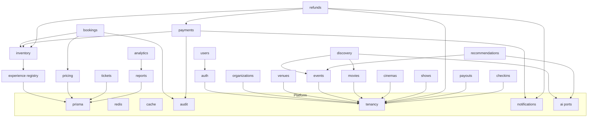
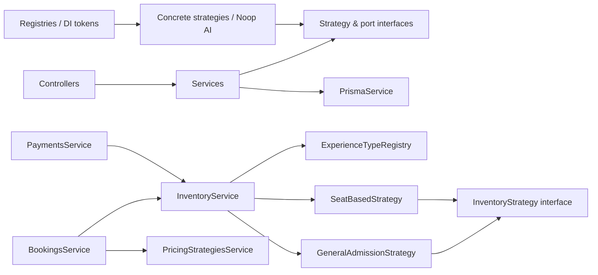

# ETicketsGo — Architecture Handbook

> The system at a glance: how ETicketsGo is put together, why the seams are where
> they are, and where to look next. Grounded in the code as it exists today — not
> aspirational. Companion docs: [Developer Handbook](./DEVELOPER-HANDBOOK.md),
> [Runbooks](./RUNBOOKS.md), [Sequence Diagrams](../diagrams/SEQUENCE-DIAGRAMS.md),
> [Context Map](../diagrams/CONTEXT-MAP.md).

---

## 1. Shape of the system

ETicketsGo is a **modular monolith** inside a **Turborepo + npm-workspaces**
monorepo. The API (`apps/api`) is a single NestJS deployable in which each domain
is a NestJS module — not a separate service. A standalone `apps/worker` process
shares the same code (it imports `@eticketsgo/api`) and runs background jobs.
Three Next.js apps (customer, organizer, admin) consume the API through a shared
`@eticketsgo/web-kit` client.

```
eticketsgo/
├─ apps/
│  ├─ api/            # NestJS modular-monolith API (Prisma, all domain modules)  :4000
│  ├─ worker/         # BullMQ worker: hold expiry + notification dispatch         :4100
│  ├─ customer-web/   # Next.js — browse → book → pay → QR wallet                  :3000
│  ├─ organizer-web/  # Next.js — events, orders, check-in, reports, payouts       :3001
│  ├─ admin-web/      # Next.js — approvals, refunds, payouts, audit, analytics    :3002
│  └─ e2e/            # Playwright critical-path tests
└─ packages/
   ├─ config/         # Shared tsconfig presets
   ├─ design-tokens/  # Semantic CSS-var tokens + Tailwind preset
   ├─ shared-types/   # Enums, transport types, feature flags (no runtime deps)
   ├─ validation/     # Zod schemas shared by API and web
   └─ web-kit/        # Shared client: API client, hooks, UI kit, app shell
```

Tech: NestJS 10, Prisma 5, PostgreSQL 16, Redis 7 (holds/cache/queues via BullMQ),
Next.js App Router + React + Tailwind + shadcn/ui, Zod validation shared end-to-end,
JWT auth (access + rotating refresh), strict TypeScript throughout.

---

## 2. Bounded contexts and responsibilities

Each context is a NestJS module under `apps/api/src`. Registration order lives in
`apps/api/src/app.module.ts`.

**Platform / cross-cutting**

| Module    | Responsibility                                                             |
| --------- | -------------------------------------------------------------------------- |
| `config`  | Zod-validated environment loading (`loadConfig`), fail-fast at boot.       |
| `prisma`  | `PrismaService` — the single DB gateway.                                   |
| `redis`   | `RedisService` — connection + `ping` for readiness.                        |
| `cache`   | `CacheService.getOrSet` — short-TTL read caching (discovery, sections).    |
| `audit`   | `AuditService.record` — append-only `AuditLog` writes.                     |
| `tenancy` | `OrgAccessService` — org-membership / platform-admin authorization checks. |
| `health`  | `/health` liveness, `/ready` (Postgres + Redis) readiness probes.          |
| `common`  | Error envelope, `AllExceptionsFilter`, correlation-id middleware, guards.  |

**Identity & access**

| Module          | Responsibility                                                         |
| --------------- | ---------------------------------------------------------------------- |
| `auth`          | Register/login/refresh (rotation)/logout/me; global JWT + Roles guard. |
| `users`         | Profile, admin user search.                                            |
| `organizations` | Org registration, members, invites, admin organizer review.            |

**Catalog & venue**

| Module    | Responsibility                                                                |
| --------- | ----------------------------------------------------------------------------- |
| `events`  | Events (the physical Experience root), sessions, ticket types; public browse. |
| `venues`  | `Venue` / `VenueArea` — shared location root.                                 |
| `movies`  | `Movie` film catalogue (org-scoped) + public movie read surface.              |
| `cinemas` | `Cinema` (optionally linked to a `Venue`).                                    |
| `shows`   | Screens + seat maps; a "show" is an `EventSession` with a `screenId`.         |

**Commerce**

| Module      | Responsibility                                                                         |
| ----------- | -------------------------------------------------------------------------------------- |
| `pricing`   | Fee calculation (`PricingService`) + pluggable pricing strategies/rules + coupon math. |
| `inventory` | Pluggable `InventoryStrategy` (GA / seat) resolved per experience type.                |
| `bookings`  | Atomic hold + booking creation + idempotency + lazy hold expiry.                       |
| `payments`  | Payment intent, mock-pay, signed webhook → confirm (issue tickets) / fail.             |
| `tickets`   | QR-signed ticket wallet.                                                               |
| `checkins`  | Scan (SUCCESS/DUPLICATE/INVALID/CANCELLED/WRONG_SESSION) + reversal.                   |
| `refunds`   | Refund request → eligibility → admin/owner decision → atomic settle.                   |
| `payouts`   | Organizer settlement generation + admin mark-paid.                                     |

**Insight & engagement**

| Module            | Responsibility                                                                    |
| ----------------- | --------------------------------------------------------------------------------- |
| `discovery`       | Composed discovery feeds via `DiscoveryStrategy` registry; capabilities endpoint. |
| `recommendations` | "You might also like" via `RecommendationStrategy` registry.                      |
| `reports`         | Organizer event report, admin dashboard, audit log.                               |
| `analytics`       | Reusable aggregate blocks (organizer/venue/customer/platform).                    |
| `reviews`         | Booking-gated reviews/ratings.                                                    |
| `notifications`   | Pluggable channels, templates, preferences, scheduled dispatch.                   |
| `admin`           | Admin-only oversight surfaces.                                                    |
| `ai`              | AI extension **ports** (interfaces) with Noop default bindings.                   |

---

## 3. Layering / Clean-Architecture direction

The API follows a layered dependency direction inside each module:

```
Controller  →  Service (application/domain logic)  →  PrismaService (persistence)
     ▲                    │
   DTOs / Zod         Strategy / port interfaces  ←  concrete strategies, AI Noops
```

- **Controllers** are thin: parse/validate (Zod via `@eticketsgo/validation`),
  delegate to a service, and return. Guards (`JwtAuthGuard`, `RolesGuard`,
  `ThrottlerGuard`) and the `AllExceptionsFilter` are applied globally in
  `app.module.ts`.
- **Services** own domain logic and transactions. They depend on **interfaces**
  (`InventoryStrategy`, `PricingStrategy`, `NotificationChannel`, AI ports) rather
  than concrete implementations, so behaviour is extended by adding an
  implementation, not by editing the caller.
- **Persistence** is Prisma. The atomicity-critical mutations run inside
  `prisma.$transaction`, and strategies receive the caller's `tx` client so an
  inventory hold composes atomically with the booking write.

The direction of imports is **acyclic** and enforced in CI (`npm run deps:check`
= `madge --circular` over `apps/api/src` and `apps/worker/src`). See the
[Context Map](../diagrams/CONTEXT-MAP.md) for the enforced rules.

---

## 4. Strategy seams (the open/closed core)

Every place the platform expects to grow is a **seam**: the caller depends on an
interface, concrete implementations register themselves, and adding a variant
touches only the new file plus one registration line. This is the through-line of
ADR-009, ADR-010, ADR-013, and ADR-019 through ADR-022.

### 4.1 Experience discriminator

`Event.experienceType` (`ExperienceType`: `EVENT | MOVIE | MUSEUM | THEME_PARK |
ATTRACTION | TOUR`, default `EVENT`) is a **discriminator column on the existing
`Event` table** — there is no separate `Experience` table (ADR-009). The
`ExperienceTypeRegistry` (`apps/api/src/experience/experience-type.registry.ts`)
maps each type to the platform capabilities it uses, starting with its inventory
kind. Unmapped types fail loudly ("Booking is not yet available for …") rather
than silently mis-booking.

### 4.2 Inventory (`InventoryStrategy`)

- Interface: `apps/api/src/inventory/inventory-strategy.interface.ts`
  (`reserve` / `confirm` / `release` / `refund` / `availability`).
- Resolver: `InventoryService.forExperienceType(type)` → registry → strategy.
- Implementations: `GeneralAdmissionInventoryStrategy` (per-ticket-type counters,
  `EVENT`), `SeatBasedInventoryStrategy` (per-seat `ShowSeat` rows, `MOVIE`).
- **Why open/closed:** `BookingsService` and `PaymentsService` call the interface;
  they never reference a concrete strategy or branch on experience type. Capacity /
  time-slot strategies (museums/tours) drop in with a registry line and a new file.

### 4.3 Pricing (`PricingStrategy` + `PricingRule`)

- Interface: `apps/api/src/pricing/pricing-strategy.interface.ts`.
- Resolver: `PricingStrategiesService.quote(ctx)` — `EVENT → TIER`, `MOVIE → SEAT`.
- Base strategies: `FlatPricingStrategy`, `TierPricingStrategy`, `SeatPricingStrategy`
  (all return the ticket type's **face price**, so subtotals are byte-for-byte
  unchanged).
- Rules: `Weekend / Holiday / EarlyBird / Member / Dynamic` pure adjustments.
  `rulesFor()` returns an **empty list by default** — rules exist and are unit
  tested but change no live price until a future per-experience pricing config
  activates them (dynamic pricing is additionally gated by the `dynamicPricing`
  flag). Coupon math is centralized in `computeCouponDiscountMinor`.
- Fee calculation (`PricingService.quote` + DB `FeeRule` tiers) is orthogonal and
  unchanged; it operates on the subtotal the strategy produces.

### 4.4 Notification channels (`NotificationChannel`)

- Interface + registry: `apps/api/src/notifications/channels/`.
- Channels: `email`, `sms`, `whatsapp`, `push`, `in_app` — all **log-only stubs**
  today; each documents where a real provider (SendGrid/Twilio/FCM) binds.
- `NotificationService.send()` keeps its original signature and defaults to
  `['email']`, so the four callers (bookings, payments, refunds, check-in) are
  unchanged. Preferences, templates+locale, `schedule`/`cancel`/`dispatchDue`
  (worker-driven retryable delivery) are additive.

### 4.5 Discovery (`DiscoveryStrategy`)

- Interface + token: `apps/api/src/discovery/strategies/discovery-strategy.interface.ts`
  (`DISCOVERY_STRATEGIES`).
- Composer: `DiscoverySectionsService` — runs every registered strategy, drops
  empty sections, caches 45s. Adding a section = registering a strategy in
  `DiscoveryModule` (no composer change).
- Strategies: Trending, Popular, Weekend, NewReleases, Nearby (city-based),
  OrganizerSpotlight, VenueSpotlight, Recommended (routed through the AI port).

### 4.6 Recommendations (`RecommendationStrategy`)

- Interface + token: `apps/api/src/recommendations/strategies/recommendation-strategy.interface.ts`
  (`RECOMMENDATION_STRATEGIES`).
- Composer: `RecommendationService` — seeded blend (ContentBased + Organizer +
  Venue) or Trending when no seed; dedupes, excludes the seed, routes through the
  AI `RecommendationEngine` port, caps to `limit`.
- Strategies: Trending, ContentBased, Organizer, Venue, RecentlyViewed
  (client-supplied ids), Collaborative (documented placeholder → falls back to
  trending), AiRecommendation (thin adapter over the AI port).

### 4.7 AI ports (`ai.ports.ts`)

Six extension interfaces — `RecommendationEngine`, `SearchRanking`,
`OrganizerCopilot`, `MarketingAssistant`, `PricingAssistant`, `ReviewModeration` —
each bound to a **Noop** (identity / empty / allow-all) in `AiModule` and exported
by DI token. `DiscoveryService` and `RecommendationService` are **real consumers**
of `RECOMMENDATION_ENGINE`, so the port is live, not dead code. Binding a real
model is a one-line `useClass` swap in `AiModule`; no consumer changes. The
`aiRecommendations` flag governs when a non-Noop binding is activated.

---

## 5. Money & inventory atomicity guarantees

- **Money is integer minor units** (paise) everywhere — no floats. Fee amounts are
  **snapshotted onto each `Booking`** (`bookingFeeMinor`, `paymentFeeMinor`,
  `discountMinor`, `customerFeeMinor`, `organizerFeeMinor`, `totalMinor`), so
  changing a `FeeRule` later never alters historical orders.
- **General-admission stock** lives in `TicketInventory` (`quantityTotal / Sold /
Held` + `version`). The hold is an atomic conditional `UPDATE … WHERE (total -
sold - held) >= qty` — oversell-proof under concurrency because the database, not
  application code, arbitrates.
- **Seat stock** lives in `ShowSeat` (one row per session×seat). The hold is a
  single conditional `UPDATE … SET status='HELD' WHERE … status='AVAILABLE'`; if
  the affected row count ≠ seats requested, some seat was taken and the whole
  booking transaction rolls back — double-book-proof by construction.
- **Transaction ownership:** the booking/payment service owns the
  `prisma.$transaction`; the inventory strategy receives that `tx` and mutates
  stock inside it. Hold + booking (and confirm + issue-tickets) are one atomic unit.
- **Webhook idempotency:** confirmation flips `PENDING_PAYMENT → CONFIRMED` via an
  atomic `updateMany` guard; only the winning delivery issues tickets, so a
  re-delivered webhook can never double-issue.
- **Refund settlement:** a `REQUESTED → PROCESSING` atomic claim happens **before**
  any provider call, preventing concurrent double-approval (double provider
  refunds); voided tickets return stock through the same inventory strategy (movie
  seats flip `SOLD → AVAILABLE`).

---

## 6. Feature-flag framework

Flags live in `packages/shared-types/src/features.ts` (`FEATURE_DEFAULTS`).
Shipped capabilities default `true`; unfinished enterprise capabilities default
`false` and are surfaced only behind the flag (never as dead code — see ADR-015,
ADR-017).

- Resolve a flag with `isFeatureEnabled(flag)`.
- Override per deployment via env: `FEATURE_<KEY>` or `NEXT_PUBLIC_FEATURE_<KEY>`,
  where `<KEY>` is the upper-snake name in the `ENV_KEY` map (e.g.
  `FEATURE_AI_RECOMMENDATIONS`, `FEATURE_DYNAMIC_PRICING`, `FEATURE_SPONSORS`).
  Truthy values are `1` or `true`.
- `GET /api/capabilities` returns the resolved flag map; the organizer **Premium &
  enterprise** page renders `ENTERPRISE_FEATURES` from it.

Live flags: `savedEvents`, `reviews`, `organizerProfiles`, `eventFaq`,
`experienceDiscovery`, `community`. Enterprise (default off): `memberships`,
`subscriptions`, `organizerCrm`, `marketingAutomation`, `dynamicPricing`,
`whiteLabel`, `sponsors`, `eventTemplates`, `aiRecommendations`.

---

## 7. Architecture Decision Records

ADRs live in [`docs/adr/`](../adr). Index:

| ADR                                              | One-liner                                                                      |
| ------------------------------------------------ | ------------------------------------------------------------------------------ |
| [009](../adr/ADR-009-experience-platform.md)     | Experience via a discriminator column on `Event`, not a new parent table.      |
| [010](../adr/ADR-010-inventory-strategy.md)      | Pluggable `InventoryStrategy` resolved per experience type.                    |
| [011](../adr/ADR-011-movie-domain.md)            | Additive Movie/Cinema/Screen domain reusing the Event/Booking machinery.       |
| [012](../adr/ADR-012-venue-platform.md)          | Grow the venue hierarchy incrementally per experience type.                    |
| [013](../adr/ADR-013-seat-reservation.md)        | Seat maps + `ShowSeat` + `SeatBasedInventoryStrategy` (atomic seat holds).     |
| [014](../adr/ADR-014-experience-discovery.md)    | One `/public/discovery` composing existing services + AI port.                 |
| [015](../adr/ADR-015-organizer-crm.md)           | Organizer CRM as a flag-gated capability (foundation only).                    |
| [016](../adr/ADR-016-community.md)               | Consolidate existing community features under the `community` flag.            |
| [017](../adr/ADR-017-sponsor-management.md)      | Sponsor management as a flag-gated capability (foundation only).               |
| [018](../adr/ADR-018-ai-foundations.md)          | AI as extension ports with Noop default bindings.                              |
| [019](../adr/ADR-019-pricing-strategy.md)        | Pluggable `PricingStrategy` + composable pricing rules (no live price change). |
| [020](../adr/ADR-020-notification-strategy.md)   | Pluggable notification channels + templates + scheduled dispatch.              |
| [021](../adr/ADR-021-discovery-strategy.md)      | `DiscoveryStrategy` seam composing per-lens sections.                          |
| [022](../adr/ADR-022-recommendation-strategy.md) | `RecommendationStrategy` seam routing through the AI port.                     |
| [023](../adr/ADR-023-analytics-platform.md)      | Reusable analytics aggregate blocks; fixes the organizer dashboard N+1.        |

Engineering/quality reports live in [`docs/reports/`](../reports)
(architecture review, engineering health, merge readiness, performance, production
readiness, security, tech-debt register).

---

## 8. Bounded-context map (allowed dependencies)



Rule: a domain talks to another domain only through its **application service or
published interface/registry** — never another domain's Prisma repository. All
domains may use the Platform layer (Prisma/Redis/Cache/Audit/Tenancy). See the
[Context Map](../diagrams/CONTEXT-MAP.md) for the full communication rules.

---

## 9. Module import-direction diagram

Imports flow one way (callers → seams → platform) and the graph is **acyclic**,
verified by `npm run deps:check` (`madge --circular`) in CI.



The booking/payment engines point **at the `InventoryStrategy` interface**; the
concrete strategies point at the same interface. No arrow ever runs from a caller
to a concrete strategy — that is what keeps the engine open for extension and
closed for modification.
