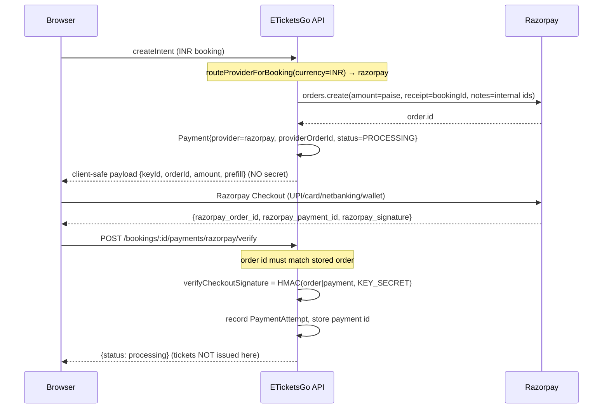
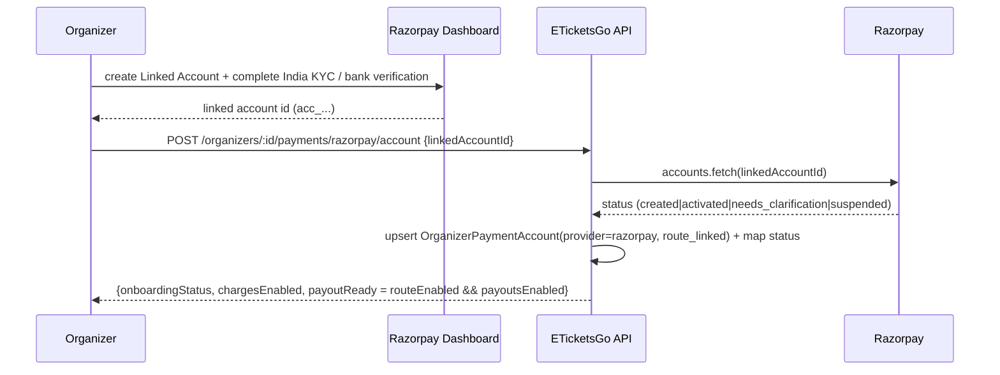

# Razorpay Payments + Route (India) — Architecture

How ETicketsGo takes money for tickets in India and pays Indian organizers, using
**Razorpay Orders + Checkout** for the customer charge and **Razorpay Route** to
settle each organizer's proceeds. This runs **simultaneously** with the US/Stripe
integration; the two paths never touch each other.

This document is grounded in the actual implementation:

| Concern                                                          | Source                                                                              |
| ---------------------------------------------------------------- | ----------------------------------------------------------------------------------- |
| Provider routing (currency-authoritative) + money math           | `packages/shared-types/src/marketplace.ts`                                          |
| Adapter resolution (US + IN run at once)                         | `apps/api/src/payments/provider/payment-provider.resolver.ts`                       |
| Razorpay adapter (Order, Checkout/webhook verify, refund, Route) | `apps/api/src/payments/provider/razorpay-payment.provider.ts`                       |
| Order + Checkout + verify flow                                   | `apps/api/src/payments/razorpay/razorpay-order.service.ts`                          |
| Checkout intent branch + authoritative ticket issuance           | `apps/api/src/payments/payments.service.ts`                                         |
| Webhook pipeline (controller / ingest / processor)               | `apps/api/src/payments/razorpay/razorpay-webhook.{controller,service,processor}.ts` |
| Organizer Linked Account (Route) onboarding                      | `apps/api/src/payments/razorpay/razorpay-connect.{service,controller}.ts`           |
| Settlement lifecycle (shared with Stripe)                        | `apps/api/src/payments/settlement/settlement.service.ts`                            |
| Dispute sync (shared)                                            | `apps/api/src/payments/dispute/dispute.service.ts`                                  |
| Config + boot validation                                         | `apps/api/src/config/configuration.ts`, `.env.example`                              |

---

## 1. India business model

- Indian bookings are priced and charged in **INR**. Razorpay amounts are integer
  **paise** (the INR subunit) — identical to our internal `amountMinor`. No floating point.
- The customer pays the **full booking total to the ETicketsGo platform Razorpay
  account**. Charges land on the platform account; the organizer is **not** paid at
  charge time.
- The organizer's proceeds are moved **later**, via **Razorpay Route** transfers to the
  organizer's **Linked Account**, only after the event completes and an admin approves +
  releases the settlement.
- Razorpay's own bank settlements (`settlement.*` events) move platform funds from
  Razorpay to the platform bank account — those are acknowledged but drive no organizer
  payout logic.

> **GST invoicing is NOT implemented.** No Indian tax computation, GSTIN capture, or
> tax-invoice generation exists in this integration. That is a legal/accounting
> follow-up — do not assume any tax logic is present.

---

## 2. Provider routing (server-side, currency-authoritative)

Routing is decided from **trusted business data**, never a client-supplied provider
name (`routeProviderForBooking` in `marketplace.ts`):

- `currency === 'USD'` → **stripe**
- `currency === 'INR'` → **razorpay**
- anything else → `null` → the caller rejects with a 400 (`No payment provider supports
currency …`).

Currency is authoritative because stored country strings are inconsistent (`"India"` vs
`"IN"`). Country is used only for a **consistency guard** (`isCountryConsistent`): an
empty/unknown country passes, but a clearly mismatched country (e.g. Razorpay + a US-only
country) is rejected. Accepted India tokens: `IN`, `IND`, `INDIA`.

`PaymentProviderResolver` lazily constructs each adapter from config **on first use** and
caches it in the registry. That is what lets **US → Stripe** and **IN → Razorpay** run
simultaneously: boot never needs every provider's keys, and a selected adapter's
constructor **fails fast** if its server secrets are missing. In `PaymentsService.createIntent`
the INR branch delegates to the Razorpay Order flow **only when INR routes to Razorpay AND
`RAZORPAY_KEY_ID` is configured** — otherwise the existing Stripe/mock path is left exactly
as-is (so dev/e2e with INR + mock is unaffected).

---

## 3. Charge-on-platform + Route-transfer-at-settlement

This mirrors Stripe's Separate Charges & Transfers:

- **Charge:** `createPayment` creates a Razorpay **Order** (`orders.create`) with
  `amount` in paise, `receipt = bookingId` (our idempotent business key), and
  `notes` containing **internal identifiers only** — `bookingId`, and optionally
  `eventId`/`organizerId`. **Never buyer PII** (no email/name/phone) in notes. The buyer
  pays via Razorpay Checkout against that Order; funds land on the platform account.
- **Transfer:** the organizer's `organizerNet` is moved later by an explicit Route
  transfer (`transfers.create`) that runs **only** after the event is `COMPLETED`, an admin
  approves the settlement, and the payable amount is **recomputed immediately before
  transfer** (deducting refunds, disputes, prior transfers, and a configurable reserve).

### Why funds are held

A ticketing marketplace must hold an organizer's money until the event actually happens
(cancellations, no-show events, chargebacks, fraud). Holding gives us control:

- **We decide when funds move** — proceeds stay on the platform balance until release.
- **We can block or reverse cleanly** — an open dispute blocks an un-transferred
  settlement; a refund or lost dispute after transfer is clawed back with a Route
  transfer reversal.
- **The platform is the merchant of record** — refunds and disputes settle against the
  platform account, giving one place to reconcile.

### Route gate (India-specific)

Route is **OFF by default** (`RAZORPAY_ROUTE_ENABLED=false`). When a Razorpay settlement is
released:

1. If Route is **not enabled** → settlement is set **BLOCKED** with reason
   _"Razorpay Route is not enabled; organizer payout is on hold."_
2. If Route is enabled but there is **no linked account** → **BLOCKED** with
   _"No active Razorpay linked account for this organizer."_

There is **never a fake transfer**. Until Route is activated and enabled, Indian organizer
payouts are held with a documented manual policy (see the production checklist).

---

## 4. Data model reuse

The India path reuses the **same** models as Stripe — no Razorpay-specific tables:

- **`Payment`** — `provider='razorpay'`, `providerOrderId` = Razorpay Order id,
  `providerPaymentIntentId`/`providerRef` = Razorpay Payment id after Checkout verify,
  plus the money split (`subtotalMinor`, `taxMinor`, `platformFeeMinor`, `organizerNetMinor`).
- **`OrganizerPaymentAccount`** — `provider='razorpay'`, `accountType='route_linked'`,
  `providerAccountId` = the Linked Account id, plus mapped KYC/activation state.
- **`Settlement`** — one per `(eventId, currency)`; `provider` is derived from the actual
  payments (INR → razorpay). Same lifecycle and money math as Stripe.
- **`WebhookEvent`** — durable, deduplicated Razorpay events (`provider='razorpay'`).
- **`Dispute`** — synced via the shared `DisputeService.syncFromWebhook`.
- **`PaymentAttempt`** — records each Checkout verify attempt (CREATED / FAILED).

Money math is the shared, framework-free code in `marketplace.ts`:
`organizerNet = subtotal − organizerFee − discount` (clamped ≥ 0);
`platformFee = total − organizerNet`. The reserve is withheld in basis points via
`STRIPE_SETTLEMENT_RESERVE_BPS` (shared config key, reused by Razorpay).

---

## 5. Signature model (two distinct secrets)

- **Checkout success signature** (synchronous integrity check): HMAC-SHA256 of
  `order_id|payment_id` keyed by the **API key secret** (`RAZORPAY_KEY_SECRET`),
  timing-safe compared to `razorpay_signature`.
- **Webhook signature** (authoritative): HMAC-SHA256 of the **raw request body** keyed by
  the **webhook secret** (`RAZORPAY_WEBHOOK_SECRET`), timing-safe compared to the
  `X-Razorpay-Signature` header.

The webhook secret is **DISTINCT** from the API key secret — boot **fails** if they are
equal (`assertRazorpayConsistency`). The browser Checkout result is never trusted as proof
of payment; the signed webhook is authoritative.

---

## 6. Authoritative ticket issuance

Tickets are issued **only** by the webhook path, shared with Stripe
(`PaymentsService.confirm` via `processVerifiedEvent`):

- The webhook processor maps `order.paid` / `payment.captured` → `payment.succeeded` and
  calls `payments.processVerifiedEvent`.
- `confirm()` enforces: booking is `PENDING_PAYMENT`, the provider-reported
  `amountMinor` **equals** `booking.totalMinor` (a mismatch is refused and flagged
  `PAYMENT_AMOUNT_MISMATCH` for reconciliation — no tickets), and an **atomic**
  `PENDING_PAYMENT → CONFIRMED` claim so only the first delivery issues tickets. Currency
  is already pinned by routing/Order creation (INR).
- The Checkout verify endpoint and the buyer redirect **never** issue tickets; verify only
  confirms the returned order matches, validates the Checkout signature, records the
  attempt, and returns `processing`.

---

## 7. Endpoints

All under the global prefix `api`:

| Method + path                                                 | Purpose                                                      |
| ------------------------------------------------------------- | ------------------------------------------------------------ |
| `POST /api/bookings/:bookingId/payments/razorpay/verify`      | Verify Checkout signature (integrity only; no issuance).     |
| `POST /api/payments/webhooks/razorpay`                        | Signed webhook (public, HMAC-verified, durable, idempotent). |
| `POST /api/organizers/:organizerId/payments/razorpay/account` | Link a dashboard-created Linked Account id.                  |
| `GET  /api/organizers/:organizerId/payments/razorpay/status`  | Route/KYC readiness for the organizer.                       |

---

## 8. Sequence diagrams

### (a) Order + Checkout + verify



### (b) Webhook → ticket issuance (authoritative)

```mermaid
sequenceDiagram
    participant RP as Razorpay
    participant WH as Webhook controller
    participant SVC as Webhook ingest
    participant PROC as Webhook processor
    participant PAY as PaymentsService.confirm
    RP->>WH: POST /payments/webhooks/razorpay (raw body + X-Razorpay-Signature)
    WH->>SVC: ingest(rawBody, signature, X-Razorpay-Event-Id)
    Note over SVC: verifySignedEnvelope = HMAC(rawBody, WEBHOOK_SECRET)
    SVC->>SVC: dedup id = event-id header else SHA-256(rawBody)
    SVC->>SVC: upsert WebhookEvent (idempotent; skip if PROCESSED/PROCESSING)
    SVC-->>WH: {received:true, duplicate}
    SVC->>PROC: process(eventId) (async)
    Note over PROC: atomic RECEIVED/FAILED → PROCESSING claim, attempts++
    PROC->>PAY: order.paid / payment.captured → payment.succeeded
    Note over PAY: amount == booking.total? atomic PENDING_PAYMENT → CONFIRMED
    PAY->>PAY: issue tickets + assign reference + accrue settlement
    PROC->>PROC: mark PROCESSED (or FAILED→retry, DEAD_LETTER after 6)
```

### (c) Refund (pre- and post-transfer)

```mermaid
sequenceDiagram
    participant RP as Razorpay
    participant PROC as Webhook processor
    participant SET as SettlementService
    RP->>PROC: refund.created / refund.processed
    PROC->>PROC: match Payment by providerPaymentIntentId; accumulate refundedMinor (capped at capture)
    PROC->>PROC: Payment → PARTIALLY_REFUNDED / REFUNDED
    PROC->>SET: applyRefund(eventId, currency, organizerShare)
    alt Settlement not yet TRANSFERRED
        SET->>SET: refundsMinor += share (deducted at release)
    else Already TRANSFERRED (funds with organizer)
        SET->>RP: transfers.reverse(transferId, amount) via Route
        SET->>SET: TRANSFERRED → PARTIALLY_REFUNDED / REVERSED
    end
```

### (d) Route settlement release

```mermaid
sequenceDiagram
    participant Admin
    participant SET as SettlementService
    participant RP as Razorpay Route
    Admin->>SET: approve(settlement) then release(settlement)
    Note over SET: atomic APPROVED/FAILED → TRANSFER_PROCESSING claim
    alt RAZORPAY_ROUTE_ENABLED = false
        SET-->>Admin: BLOCKED "Route not enabled; payout on hold" (no transfer)
    else No linked account
        SET-->>Admin: BLOCKED "No active Razorpay linked account" (no transfer)
    else Route enabled + linked account
        SET->>SET: recompute payable (− refunds/disputes/prior/reserve)
        SET->>RP: transfers.create(account=linkedAccount, amount=payable, INR)
        RP-->>SET: transfer.id
        SET->>SET: TRANSFERRED, transferredMinor += payable; notify organizer
    end
```

### (e) Organizer Linked Account onboarding


