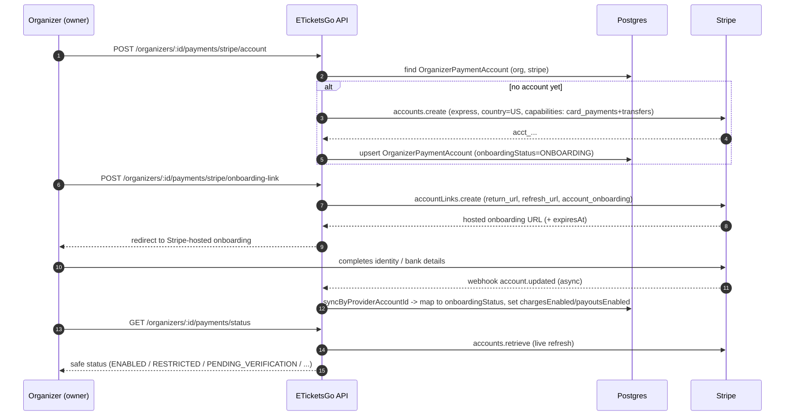
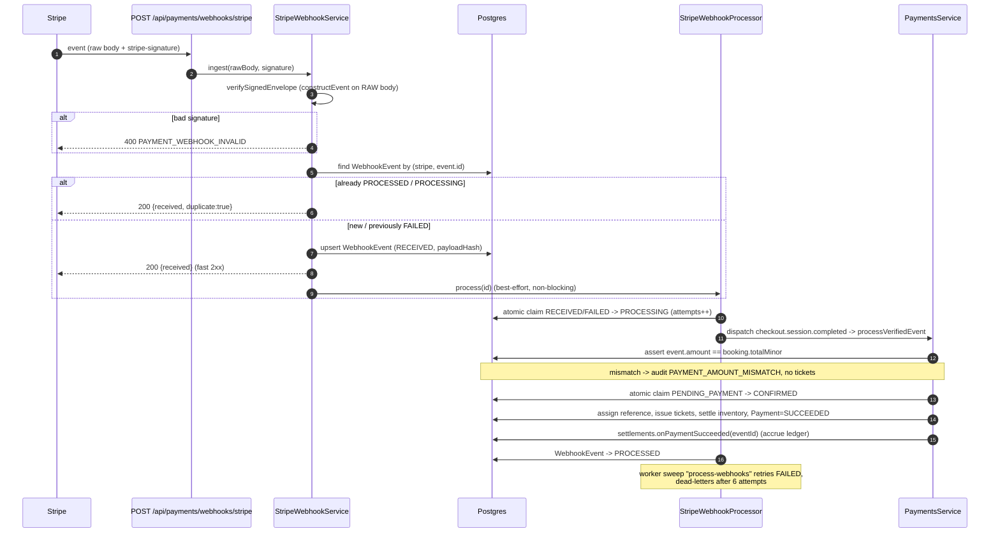
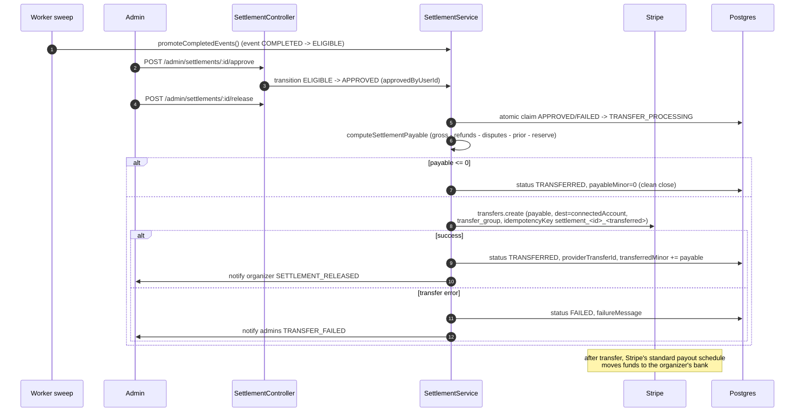

# Stripe Payments + Connect — Architecture

How ETicketsGo takes money for tickets and pays organizers, using **Stripe Checkout**
for the customer charge and **Stripe Connect** to settle each organizer's proceeds.

This document is grounded in the actual implementation:

| Concern                                                                 | Source                                                                      |
| ----------------------------------------------------------------------- | --------------------------------------------------------------------------- |
| Provider adapter (checkout, webhook verify, refund, Connect, transfers) | `apps/api/src/payments/provider/stripe-payment.provider.ts`                 |
| Provider contract                                                       | `apps/api/src/payments/provider/payment-provider.interface.ts`              |
| Checkout intent + ticket issuance                                       | `apps/api/src/payments/payments.service.ts`                                 |
| Webhook pipeline (controller / ingest / processor)                      | `apps/api/src/payments/webhooks/stripe/`                                    |
| Organizer Connect onboarding                                            | `apps/api/src/payments/connect/organizer-connect.service.ts` (+ controller) |
| Settlement lifecycle                                                    | `apps/api/src/payments/settlement/settlement.service.ts` (+ controller)     |
| Dispute sync                                                            | `apps/api/src/payments/dispute/dispute.service.ts`                          |
| Pure money math + status mapping                                        | `packages/shared-types/src/marketplace.ts`                                  |
| Data model                                                              | `apps/api/prisma/schema.prisma`                                             |

---

## 1. The charge model: Separate Charges and Transfers

ETicketsGo uses Stripe's **Separate Charges and Transfers** flow, **not**
destination charges and **not** `application_fee_amount` on the charge.

Concretely, at checkout the adapter creates a hosted Checkout Session whose
`payment_intent_data` carries **only** metadata and a `transfer_group` — there is
**no** `transfer_data`, `application_fee_amount`, or `on_behalf_of`
(`stripe-payment.provider.ts`, `createPayment`). As a result:

- The customer pays the **full booking total to the ETicketsGo platform account**.
- The organizer's proceeds are **not** moved at charge time. They are moved **later**
  by an explicit `transfers.create` (`createTransfer`) that runs **only after the
  event completes and an admin approves + releases the settlement**.
- The charge is tagged `transfer_group: etg_event_<eventId>` so the later transfer
  can be correlated back to the originating charges.

### Why we chose this (control settlement after the event)

A ticketing marketplace must be able to **hold** an organizer's money until the
event has actually happened, because ticketing carries a high rate of
cancellations, no-show events, chargebacks, and fraud. Separate Charges and
Transfers gives us that control:

- **We decide when funds move.** Proceeds stay on the platform balance and are only
  transferred after the event is `COMPLETED`, an admin has approved the settlement,
  and the payable amount has been **recomputed immediately before the transfer**
  (deducting refunds, disputes, prior transfers, and a configurable reserve).
- **We can block or reverse cleanly.** An open dispute blocks an un-transferred
  settlement; a refund or lost dispute after transfer is clawed back with a
  `transfers.createReversal`.
- **The platform is the merchant of record.** Stripe processing fees, refunds, and
  disputes all settle against the **platform** account, which keeps organizer
  accounting simple and gives us one place to reconcile.

> **Important nuance:** This model does **not** mean "Stripe delays the organizer's
> bank payout." **We** control the transfer timing. Once we execute the transfer to
> the connected account, Stripe's **standard connected-account payout schedule**
> applies to move those funds from the connected account's Stripe balance to the
> organizer's bank — that part is normal Stripe behaviour, not something we defer.

---

## 2. Responsibility matrix (who bears what)

"Platform" = the ETicketsGo Stripe account. "Organizer" = the Stripe **connected
account** (Express by default).

| Item                                 | Lands on / borne by               | Mechanism                                                                                               |
| ------------------------------------ | --------------------------------- | ------------------------------------------------------------------------------------------------------- |
| Customer charge (full booking total) | **Platform**                      | Hosted Checkout Session, no destination/app-fee                                                         |
| Stripe processing fee                | **Platform**                      | Deducted from the platform balance; the platform fee margin absorbs it                                  |
| ETicketsGo platform fee (margin)     | **Platform (retained)**           | `platformFee = total − organizerNet` (`computeMarketplaceSplit`)                                        |
| Organizer proceeds                   | **Organizer (connected account)** | Moved by `transfers.create` at settlement release                                                       |
| Refund to customer                   | **Platform**                      | `refunds.create` against the platform PaymentIntent; organizer's proportional share deducted / reversed |
| Dispute / chargeback                 | **Platform (merchant of record)** | `charge.dispute.*` mirrored; un-transferred proceeds blocked, losses recorded/reversed                  |
| Reserve withholding                  | **Platform (held)**               | `STRIPE_SETTLEMENT_RESERVE_BPS` withheld from each transfer                                             |
| Organizer bank payout                | **Organizer**                     | Stripe's standard payout schedule on the connected account, **after** our transfer                      |

### The split (pure, unit-tested)

`computeMarketplaceSplit` (`packages/shared-types/src/marketplace.ts`) runs on the
booking's snapshotted minor-unit amounts at checkout time:

```
organizerNet = max(0, subtotal − organizerFee − discount)
platformFee  = total − organizerNet          // ETicketsGo margin; pays the Stripe fee
```

All money is integer minor units (cents). `platformFee` can never be negative (the
organizer can never be owed more than the customer paid), and it is the source from
which Stripe's processing fee is effectively paid.

At settlement, `computeSettlementPayable` recomputes what to actually move:

```
base    = max(0, grossOrganizerNet − refunds − disputes − priorTransferred)
reserve = floor(base × reserveBps / 10000)
payable = max(0, base − reserve)
```

---

## 3. Data model summary

Prisma models in `apps/api/prisma/schema.prisma`:

- **Payment** (extended) — one per booking. Holds `providerPaymentIntentId` /
  `providerCheckoutSessionId`, the `connectedAccountId` it will settle to, the
  snapshotted split (`subtotalMinor`, `taxMinor`, `platformFeeMinor`,
  `organizerNetMinor`), `refundedMinor`, the unique `idempotencyKey` (== bookingId),
  and a link to its `settlementId`.
- **OrganizerPaymentAccount** — one per `(organizationId, provider)`. Stores the
  non-secret Stripe `providerAccountId` (`acct_…`), `accountType` (express),
  `onboardingStatus`, and the synced capability flags (`detailsSubmitted`,
  `chargesEnabled`, `payoutsEnabled`, `requirementsDue`, `disabledReason`). No
  credentials or PII.
- **Settlement** — event-scoped batch, unique on `(eventId, currency)`. Ledger in
  minor units (`grossSalesMinor`, `refundsMinor`, `disputesMinor`,
  `platformFeesMinor`, `reserveMinor`, `payableMinor`, `transferredMinor`), the
  Stripe `providerTransferId` (`tr_…`) once released, `status`, and audit fields
  (`approvedByUserId`, `blockedReason`, `failureMessage`, `releasedAt`).
- **WebhookEvent** — idempotency + dead-letter store, unique on
  `(provider, providerEventId)`. Holds `eventType`, a SHA-256 `payloadHash`, the
  parsed `payload`, `processingStatus`, and `attempts`.
- **Dispute** — chargeback mirror, unique on `(provider, providerDisputeId)`. Links
  to the payment/booking/organization/event, holds `amountMinor`, mapped `status`,
  raw `stripeStatus`, and `evidenceDueBy`.

### Settlement lifecycle

```
PENDING ─▶ HELD ─▶ ELIGIBLE ─▶ APPROVED ─▶ TRANSFER_PROCESSING ─▶ TRANSFERRED
   │         │         │            │                                  │
   └────▶ BLOCKED ◀────┘            └─▶ (on error) FAILED ─▶ APPROVED   ├─▶ PARTIALLY_REFUNDED
                                                                        └─▶ REVERSED
```

Transitions are guarded by `SETTLEMENT_TRANSITIONS` / `canTransitionSettlement`.
Only `APPROVED` or `FAILED` settlements are **releasable**
(`isReleasableSettlementStatus`).

---

## 4. Sequence diagrams

### (a) Organizer Connect onboarding



### (b) Checkout + payment

```mermaid
sequenceDiagram
    autonumber
    participant Buyer
    participant API as ETicketsGo API
    participant DB as Postgres
    participant Stripe as Stripe (platform acct)

    Buyer->>API: POST /payments/:bookingId/intent
    API->>DB: load booking (must be PENDING_PAYMENT, hold not expired)
    API->>API: computeMarketplaceSplit(booking snapshot)
    API->>DB: assert organizer OrganizerPaymentAccount.chargesEnabled
    Note over API: gate: no charges-enabled account -> 409, cannot sell paid tickets
    API->>Stripe: checkout.sessions.create (mode=payment, transfer_group=etg_event_<eventId>)
    Note over API,Stripe: NO transfer_data / application_fee / on_behalf_of<br/>charge lands on the PLATFORM
    Stripe-->>API: Checkout Session (url, payment_intent)
    API->>DB: Payment -> PROCESSING, snapshot split + connectedAccountId
    API-->>Buyer: clientActionUrl (hosted Checkout)
    Buyer->>Stripe: pays on hosted Checkout
    Stripe-->>Buyer: redirect to success_url (NOT proof of payment)
    Note over Buyer,API: success page only polls status;<br/>settlement is confirmed by the signed webhook only
```

### (c) Webhook → ticket issuance



### (d) Refund (pre- and post-transfer)

```mermaid
sequenceDiagram
    autonumber
    participant Ops as Ops / Refund flow
    participant Stripe
    participant Proc as StripeWebhookProcessor
    participant Settle as SettlementService
    participant DB as Postgres

    Ops->>Stripe: refunds.create (payment_intent, amount)
    Stripe-->>Proc: webhook charge.refunded (amount_refunded)
    Proc->>DB: delta = amount_refunded - Payment.refundedMinor
    alt delta <= 0
        Proc-->>Stripe: processed (idempotent no-op)
    else
        Proc->>DB: Payment.refundedMinor = amount_refunded;<br/>status REFUNDED / PARTIALLY_REFUNDED
        Proc->>Settle: applyRefund(eventId, currency, organizerShare)
        Settle->>DB: Settlement.refundsMinor += organizerShare
        alt settlement NOT yet transferred
            Note over Settle: reserved for a smaller later transfer (recomputed at release)
        else settlement already TRANSFERRED
            Settle->>Stripe: transfers.createReversal (min(share, transferred))
            Settle->>DB: transferredMinor -= reversed;<br/>status PARTIALLY_REFUNDED / REVERSED
        end
    end
```

### (e) Settlement release



---

## 5. Security invariants

- **The browser redirect is never proof of payment.** Tickets are issued only from a
  signature-verified webhook (`payments.service.ts` `confirm`).
- **Amount is re-asserted server-side.** Even a validly-signed webhook must report
  `amount == booking.totalMinor`, or the confirm is refused and an
  `PAYMENT_AMOUNT_MISMATCH` audit is recorded.
- **Idempotency everywhere.** Checkout uses `idempotencyKey = bookingId`; ticket
  issuance uses an atomic `PENDING_PAYMENT → CONFIRMED` claim; webhooks are keyed on
  Stripe's `event.id`; transfers use `settlement_<id>_<transferred>`; reversals use
  `reverse_<id>_<refundsMinor>`.
- **No secrets or PII in metadata.** Only `bookingId`, `eventId`, `organizerId`,
  `customerId`, and `environment` are ever attached.
