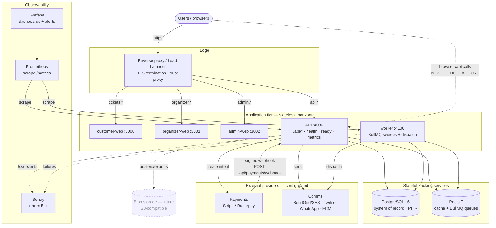
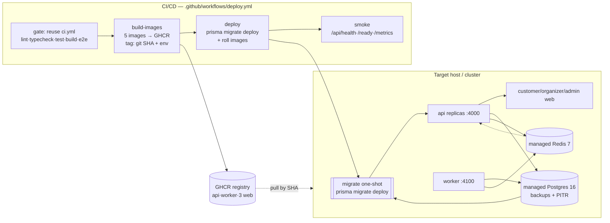

# ETicketsGo — Production Architecture

> The production topology of ETicketsGo: what runs, how it connects, where state
> lives, and where the real (payment / notification) providers plug in. This is a
> **synthesis / cross-link** document — the deep material lives in the handbooks,
> guides, and ADRs referenced throughout. It duplicates none of it.
>
> Companions: [Architecture Handbook](../handbooks/ARCHITECTURE-HANDBOOK.md) ·
> [Context Map](../diagrams/CONTEXT-MAP.md) ·
> [Sequence Diagrams](../diagrams/SEQUENCE-DIAGRAMS.md) ·
> [Deployment Guide](../guides/DEPLOYMENT.md) ·
> [Scaling Guide](./SCALING-GUIDE.md) · [Capacity Report](./CAPACITY-REPORT.md) ·
> [Monitoring Guide](../guides/MONITORING.md).

---

## 1. What runs in production

ETicketsGo is a **Turborepo modular monolith**: one NestJS API in which every
domain is a module (not a microservice), a background worker that imports the same
code, and three Next.js portals. Five **stateless** application deployables sit
over two **stateful** backing services.

| Deployable        | Image (Dockerfile)              | Port | State                | Role                                                                                 |
| ----------------- | ------------------------------- | ---- | -------------------- | ------------------------------------------------------------------------------------ |
| **api**           | `apps/api/Dockerfile`           | 4000 | none                 | NestJS modular-monolith. Serves `/api/*`, `/api/health/ready/metrics`. Horizontal.   |
| **worker**        | `apps/worker/Dockerfile`        | 4100 | none                 | BullMQ: hold-expiry sweep + notification dispatch. Health/metrics on `:4100`. ≥1.    |
| **customer-web**  | `apps/customer-web/Dockerfile`  | 3000 | none                 | Next.js standalone — browse → book → pay → QR wallet. Horizontal.                    |
| **organizer-web** | `apps/organizer-web/Dockerfile` | 3001 | none                 | Next.js standalone — events, orders, check-in, reports, payouts.                     |
| **admin-web**     | `apps/admin-web/Dockerfile`     | 3002 | none                 | Next.js standalone — approvals, refunds, payouts, audit, support, ops.               |
| **db**            | `postgres:16-alpine`            | 5432 | **system of record** | Bookings, tickets, seats, payments, refunds, payouts, audit. Managed + PITR in prod. |
| **redis**         | `redis:7-alpine`                | 6379 | derived/queues       | Cache (discovery/catalog) + BullMQ queues (AOF on). Not a source of truth.           |

The web apps call the API **from the browser** using the build-time
`NEXT_PUBLIC_API_URL` (inlined into the bundle, must be the public `/api` URL). The
API and worker share the same database and Redis. Full image design (multi-stage,
non-root, standalone) and boot order are in the
[Deployment Guide §1–2](../guides/DEPLOYMENT.md).

### Supporting infrastructure (provisioned around the deployables)

- **Reverse proxy / load balancer (TLS termination)** — routes by hostname
  (`api.*`, `tickets.*`, `organizer.*`, `admin.*`) to the right upstream; the app
  services speak plain HTTP on the private network. Set `trust proxy` at the LB.
  See [Deployment §4](../guides/DEPLOYMENT.md).
- **Observability stack** — Prometheus scrapes `/api/metrics` and worker
  `:4100/metrics`; Grafana dashboards + Prometheus alert rules; Sentry (opt-in via
  `SENTRY_DSN`); optional OpenTelemetry tracing. Shipped as
  `docker-compose.observability.yml`. See the [Monitoring Guide](../guides/MONITORING.md)
  and [MONITORING-CHECKLIST](./MONITORING-CHECKLIST.md).
- **Blob storage (future, not yet wired)** — the storage abstraction defaults to a
  `local` driver (ephemeral container path); `STORAGE_DRIVER` + `S3_*` point it at
  an S3-compatible bucket for durable posters/exports. Tracked in
  [KNOWN-LIMITATIONS](./KNOWN-LIMITATIONS.md) and the 90-day roadmap.

---

## 2. Bounded contexts and strategy seams

The API is a modular monolith; each bounded context is a NestJS module under
`apps/api/src`, with an **acyclic** dependency direction enforced in CI
(`npm run deps:check` = `madge --circular`). The full context inventory,
allowed-dependency rules, and layering are in the
[Architecture Handbook §2–4](../handbooks/ARCHITECTURE-HANDBOOK.md) and the
[Context Map](../diagrams/CONTEXT-MAP.md); the design rationale is in ADR-009
(experience platform), ADR-010/013 (inventory/seat reservation), ADR-019
(pricing), ADR-020 (notifications), ADR-021/022 (discovery/recommendation), and
ADR-023 (analytics).

The platform grows at **strategy seams** — the caller depends on an interface;
concrete implementations register themselves; adding a variant touches only the
new file plus one registration line:

| Seam                     | Interface / resolver                                         | Today                                                              |
| ------------------------ | ------------------------------------------------------------ | ------------------------------------------------------------------ |
| **Experience type**      | `ExperienceTypeRegistry` (discriminator on `Event`)          | `EVENT`, `MOVIE`; museum/tour map in unimplemented                 |
| **Inventory**            | `InventoryStrategy` via `InventoryService.forExperienceType` | GA counters (events), seat rows (movies)                           |
| **Pricing**              | `PricingStrategy` + `PricingRule`                            | Flat/Tier/Seat; rules unit-tested, inert by default                |
| **Notification channel** | `NotificationChannel` registry                               | Email/SMS/WhatsApp/Push/In-App; real transports config-gated       |
| **Discovery**            | `DiscoveryStrategy` registry                                 | Trending/Popular/Weekend/NewReleases/Nearby/Spotlights/Recommended |
| **Recommendation**       | `RecommendationStrategy` registry + **AI port**              | content/organizer/venue/trending; AI port is a Noop                |

Because `BookingsService` / `PaymentsService` call the inventory and pricing
**interfaces** (never a concrete strategy or a branch on experience type), new
experience types plug in with **zero booking-engine changes**.

---

## 3. Request & data flow

The booking money path (customer → confirmed, QR-bound ticket) is the critical
flow. Detailed sequence diagrams (hold → intent → signed webhook → confirm → issue,
plus refund and check-in) are in the
[Sequence Diagrams](../diagrams/SEQUENCE-DIAGRAMS.md). In brief:

1. **Browse** — customer-web calls read-only `@Public` routes (`/api/public/*`,
   discovery, movies); hot lists are served from a short-TTL Redis cache.
2. **Hold** — `POST /api/bookings` places an atomic conditional-`UPDATE` inventory
   hold (GA counter or per-seat `ShowSeat` row) inside a Prisma transaction;
   `PENDING_PAYMENT`. Oversell-/double-book-proof (verified live).
3. **Pay** — a payment intent is created at the configured provider; the browser
   is redirected/collected. **Confirmation never comes from the browser.**
4. **Confirm** — the provider calls `POST /api/payments/webhook` (HMAC-verified);
   `PaymentsService.confirm` flips `PENDING_PAYMENT → CONFIRMED` via a single
   idempotent `updateMany` claim and issues QR-signed tickets. GMV/booking metrics
   increment here.
5. **Fulfil** — QR tickets scanned at the gate (`checkins`); the worker sweeps
   expired holds (releasing seats) and dispatches notifications.

Prices are computed **server-side** (`ticketType.priceMinor` + fee calculator), so
guest checkout cannot inject amounts. Money/inventory transitions are atomic +
idempotent (no double-issue / double-refund / double-payout) — see the
[Security Validation A04/A08](./SECURITY-VALIDATION.md) and
[LAUNCH-READINESS](./LAUNCH-READINESS.md).

### Where the real providers plug in

Everything is behind an interface and **config-gated** — with no keys, the app
runs on mock/log adapters and behaves exactly as in dev.

- **Payments** — `apps/api/src/payments/provider/` ships `mock`, `stripe`, and
  `razorpay` providers behind `PaymentProviderInterface`, selected by
  `PAYMENT_PROVIDER_NAME`. Production sets a real provider + keys +
  `PAYMENT_WEBHOOK_SECRET`, and `PAYMENTS_MOCK_ENABLED=false` (also forced off by
  `NODE_ENV=production`). See the [Payment Integration Guide](../guides/PAYMENT-INTEGRATION.md).
- **Notifications** — `NotificationChannel` transports select real providers per
  channel: `EMAIL_PROVIDER` (sendgrid/ses), `SMS_PROVIDER` (twilio),
  `WHATSAPP_PROVIDER` (cloud), `PUSH_PROVIDER` (fcm). Default `log`. The selected
  provider **fails fast at boot** if its keys are missing. Email + in-app are the
  channels wired end-to-end; SMS/WhatsApp/push still need recipient plumbing (see
  [KNOWN-LIMITATIONS](./KNOWN-LIMITATIONS.md)). See the
  [Notification Integration Guide](../guides/NOTIFICATION-INTEGRATION.md).

---

## 4. Infrastructure diagram

---

## 5. Runtime / deployment diagram

Boot order is enforced by health conditions in `docker-compose.prod.yml`: **db +
redis healthy → `migrate` one-shot (`prisma migrate deploy`, additive-only, exits)
→ api → web apps**. The database is **never seeded** in production. Images are
built + pushed to GHCR by `.github/workflows/deploy.yml` (tagged by git SHA +
environment) and rolled out to the target host. See the
[Deployment Guide §8–9](../guides/DEPLOYMENT.md).

- **Scaling** — api + the three web apps are stateless (JWT, no sticky sessions) →
  scale horizontally behind the LB; worker runs ≥1 (jobs idempotent, retried).
  Postgres row-level write contention on the hottest inventory row is the binding
  resource — front it with PgBouncer and size for peak concurrent holds; reads are
  cheap/horizontal via the Redis cache and read replicas. See the
  [Scaling Guide](./SCALING-GUIDE.md), [Scaling Recommendation](./SCALING-RECOMMENDATION.md),
  and [Capacity Report](./CAPACITY-REPORT.md).
- **Rollback** — additive-only migrations keep the previous image compatible;
  rollback is redeploying the prior SHA tag. See the [Rollback Plan](./ROLLBACK-PLAN.md)
  and [Disaster Recovery](./DISASTER-RECOVERY.md).
